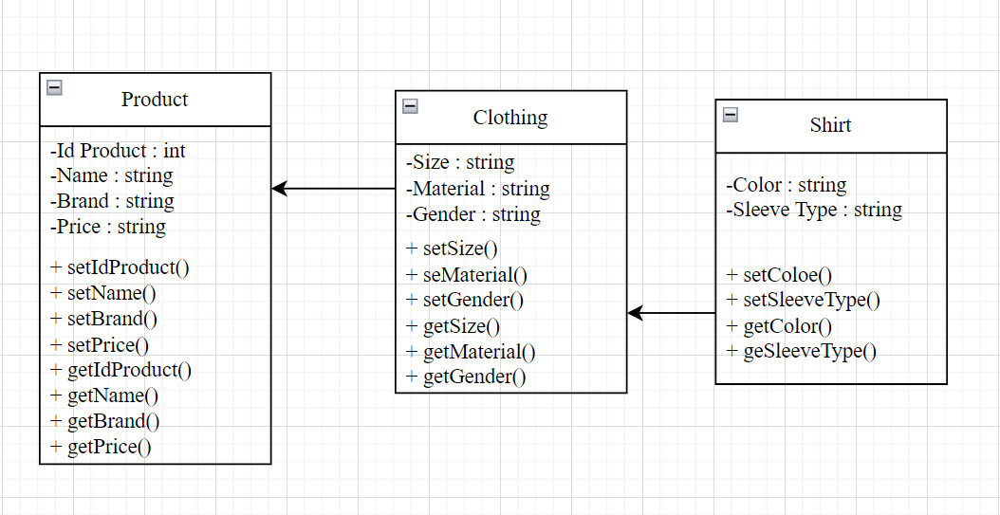

# janji
Saya Septiani Eka Putri NIM 2206000 mengerjakan Latihan Praktikum 1 dalam mata kuliah Desain dan Pemrograman Berorientasi Objek untuk keberkahanNya maka saya tidak melakukan kecurangan seperti yang telah dispesifikasikan. Aamiin

## Desain Program 
Terdiri dari 3 class yaitu **Product**, **Clothing**, dan **Shirt**. Dimana Product adalah orang tua dari Cloting atau Clothing adalah extends dari Product, lalu Clothing adalah orang tua dari Shirt atau Shirt merupakan extends dari Clothing.

#### Diagram

Didalam class **Product** terdapat 4 atribut, yaitu :
* Id Product
* Name
* Brand
* Price

Didalam class **Clothing** terdapat 3 atribut, yaitu :
* Size
* Material
* Gender

Didalam class **Shirt** terdapat 2 atribut, yaitu :
* Color
* Sleeve Type

## Alur Program
Program ini memiliki alur mulai dari objek Shirt, mengisi nilai atribut-atribut dar objek shirt yang diinisialisasi sebelumnya, memasukan objek ke dalam list hingga menampilkan beberapa objek Shirt di dalam list.

## Dokumentasi PHP

## Dokumentasi Java

## Dokumentasi CPP

## Dokumentasi Python
